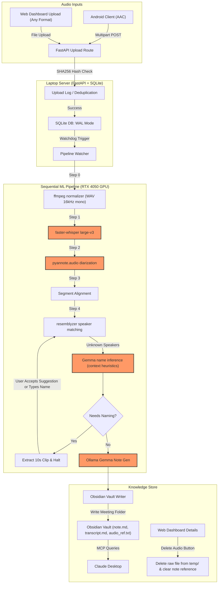

# Arc Project Audit & Architectural Analysis (Updated)

This document provides a thorough audit and architectural review of the **Arc** project files, incorporating the latest specifications for multi-format laptop uploads, FFmpeg audio normalization, contextual speaker name inference, folder-based Obsidian note structures, and manual temp file deletion.

---

## Executive Summary

Arc v1 is a local-first meeting intelligence system designed to process audio captures into structured Obsidian memories. The system has been expanded to support laptop dashboard uploads alongside Android background recording. 

A new normalization stage utilizing `ffmpeg` converts all audio inputs into standard WAV format prior to pipeline processing. Additionally, the system now implements semi-automated speaker naming via Gemma name inference from context and moves away from single-file notes in favor of isolated Obsidian **meeting folders** containing decoupled notes, transcripts, and audio references.

---

## System Architecture Flow

The updated data and processing flow reflects the dual-upload sources, normalization step, contextual name inference, and folder-based storage output:



---

## Technical Deep Dives & Risk Analysis

### 1. Android Background Recording
*   **Foreground Service manifest constraints:** Ensure `android:foregroundServiceType="microphone"` is declared in the `AndroidManifest.xml` to avoid system crashes on Android 14/15.
*   **Runtime Permissions:** Request `POST_NOTIFICATIONS` runtime permission on Android 13+ to ensure the persistent recording notification is not silently hidden or suppressed by the OS.
*   **Doze Mode & Battery Savers:** Since background audio processes are highly throttled, prompt the user during pairing to exclude Arc from battery optimization settings.

### 2. Multi-Format Normalization & FFmpeg (Systems Mindset)
*   **Subprocess Path Safety:**
    *   **The Issue:** The TRD introduces `ffmpeg` as a subprocess to normalize `.m4a`, `.mp3`, `.mp4`, `.webm`, `.wav`, etc., to WAV 16kHz mono.
    *   **The Risk:** Executing command strings through `shell=True` on Windows is highly vulnerable to command injection and path splitting errors when directories contain spaces (e.g. `C:\Users\Lenovo\Desktop\Code\Brain (ruchitdas36)`).
    *   **Mitigation:** Always invoke `subprocess.run` with list arguments and path objects, keeping `shell=False` (default):
        ```python
        import subprocess
        from pathlib import Path
        
        cmd = ["ffmpeg", "-y", "-i", str(input_path), "-ar", "16000", "-ac", "1", str(output_path)]
        subprocess.run(cmd, check=True)
        ```
*   **Resource Allocation during Dashboard Uploads:**
    *   **The Issue:** Users can upload arbitrary, large audio files (like 3-hour Zoom meetings) directly via the laptop web interface.
    *   **The Risk:** Heavy FFmpeg conversion on large files can block FastAPI worker processes and cause temporary UI freezes or request timeouts.
    *   **Mitigation:** Enforce asynchronous file uploads in FastAPI (`UploadFile` utilizing temporary spool files) and execute the FFmpeg normalization inside a background worker thread or process.

### 3. Contextual Speaker Name Inference (AI & Prompt Mindset)
*   **Ambiguity in Voice Reference:**
    *   **The Issue:** The pipeline uses Gemma 4:4B to infer unknown speakers' names from the transcript context (e.g. "Priya what do you think?").
    *   **The Risk:** Direct address heuristics are prone to false attributions. For example, if Speaker A says "Hey Rahul, is Priya joining?", Gemma might mistakenly associate Speaker A's voice with "Rahul" or "Priya" instead of the actual recipient.
    *   **Mitigation:** Apply structured prompting that instructs Gemma to isolate *response sequences*. A speaker should only be identified as "Rahul" if a subsequent segment shows the speaker responding to the name, or if the name occurs in direct greeting vocatives.
*   **Database Schema Gap:**
    *   **The Issue:** The SQLite tables in `05-BackendSchema.md` do not include fields to hold name recommendations between pipeline steps.
    *   **The Risk:** If the pipeline halts at `needs_naming`, there is no structured field to store the LLM-inferred suggestions, forcing either a re-run of Gemma or hacky temporary files.
    *   **Mitigation:** Update the `speakers` table (or create a temporary `inferred_speakers` relation) to store `suggested_name TEXT` alongside the voice embedding.

### 4. Folder-Based Obsidian Vault Structures (Knowledge Management Mindset)
*   **Decoupled Sync Issues:**
    *   **The Issue:** Each meeting is written as a folder containing `note.md`, `transcript.md`, and `audio_ref.txt`.
    *   **The Risk:** If the user moves, archives, or renames the folder within Obsidian, the absolute path references stored in the SQLite `meetings.obsidian_note_path` column will break.
    *   **Mitigation:** Store folder paths in SQLite relative to the vault root (e.g., `Meetings/2025-05-26-1430-Rahul-Priya/`). The dashboard and backend can then resolve the absolute path dynamically using the `OBSIDIAN_VAULT_PATH` environment variable.
*   **Frontmatter Modification Hazards:**
    *   **The Issue:** Clicking "Delete audio" in the web UI must delete the raw file from `temp/` and remove references in the note.
    *   **The Risk:** Modifying `note.md` in-place while Obsidian has it open can cause race conditions or conflicting writes.
    *   **Mitigation:** Perform surgical regex replacements or use `python-frontmatter` to update the YAML block without rebuilding the entire file, and ensure file locks are handled properly.
*   **Path Traversal on Deletion:**
    *   **The Issue:** The web UI exposes an endpoint to delete files from `temp/`.
    *   **The Risk:** A malformed POST request (e.g., `/delete_audio/../../system32/cmd.exe`) could delete unrelated files on the laptop.
    *   **Mitigation:** Strictly validate path resolution using `pathlib.Path.resolve()` and verify that the target path is a direct descendant of the allowed temp directory.

---

## SQLite Database Schema Updates

To support these new features, the following modifications to `05-BackendSchema.md` are recommended:

### Table `speakers` (Updated)
Add `suggested_name` to store context-inferred names:
```sql
ALTER TABLE speakers ADD COLUMN suggested_name TEXT NULLABLE;
```

### Table `meetings` (Updated)
*   Change `archive_path` references to `temp_path` (storing the path in the local `temp/` folder).
*   Add a flag or status representing whether the audio has been deleted: `audio_deleted INTEGER DEFAULT 0`.

---

## Summary of Key Recommendations

| Component | Identified Risk | Recommended Action |
| :--- | :--- | :--- |
| **Android Client** | Service termination on Android 14+ | Declare `foregroundServiceType="microphone"` in the manifest and request notifications permission. |
| **FFmpeg Normalizer** | Shell injection & path parsing bugs | Use `subprocess.run` with list parameters and `shell=False` on Windows. |
| **Suggested Naming** | Inaccurate name inference by LLM | Prompt Gemma to identify speakers only via response patterns, and add `suggested_name` to the database schema. |
| **Obsidian Vault** | Broken links when moving folders | Save vault paths in SQLite as relative paths rather than absolute paths. |
| **Audio Deletion** | Path traversal security vulnerabilities | Enforce strict parent-child validation using `Path.resolve()` before deleting raw files. |
